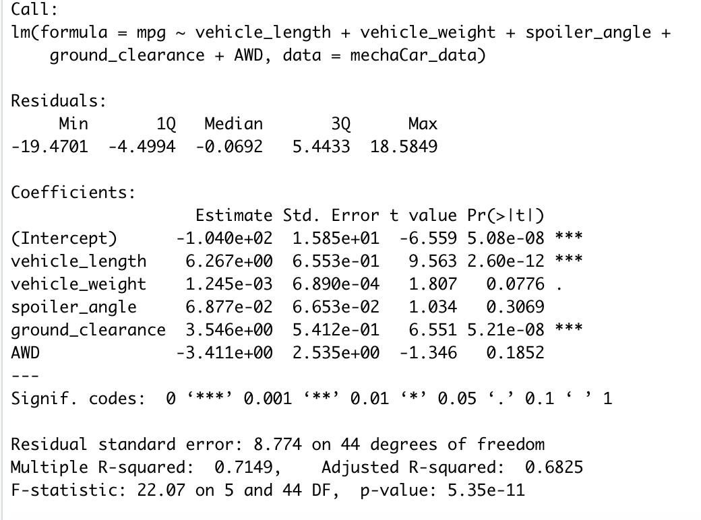
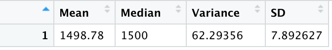
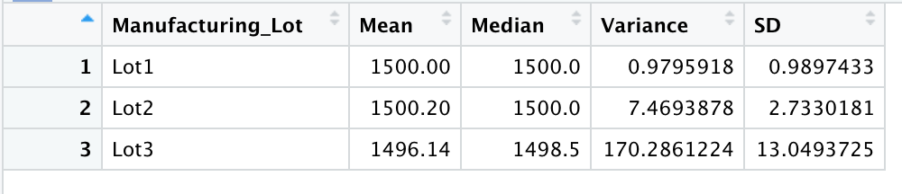
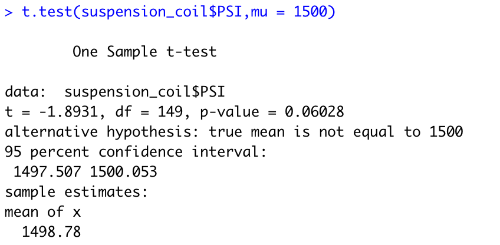
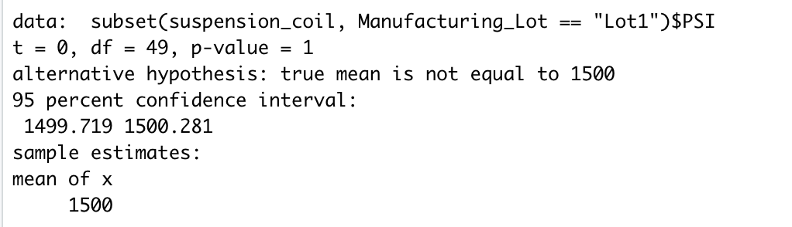
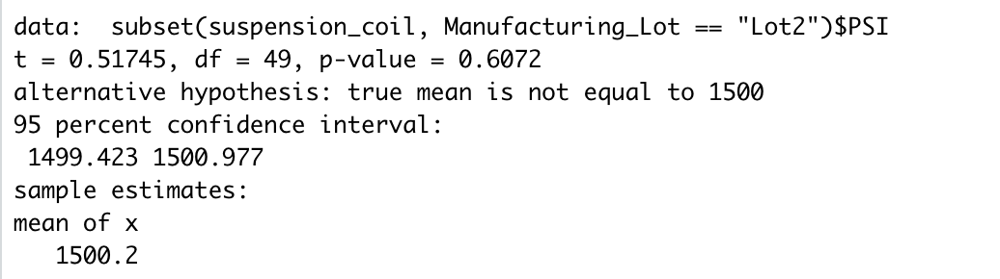
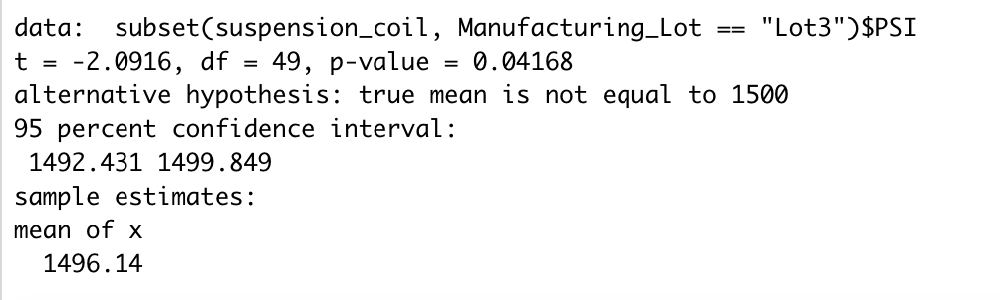

# MechaCar_Statistical_Analysis
The goal of this project is to create three technical analysis and also provide a proposal for further statistical study.

# Overview
AutosRUs’ newest prototype, the MechaCar, is suffering from production troubles that are blocking the manufacturing team’s progress. AutosRUs’ upper management has requested the data analytics team to review the production data for insights that may help the manufacturing team.

## Linear Regression to Predict MPG

As per the linear regression, Vehicle Length and Ground Clearance affected mpg values in the dataset. P-value for Vehicle Length is 2.60e-12 and for Ground Clearance is 5.21e-8. They are less than 0.05.

The slope of linear model is negligible to zero. Overall p-value is 5.35e-11 (i.e. 0.0000000000535). Since this number is less than 0.05, Null hypothesis can be rejected. 

This model predicts MechaCar prototype effectively. The r-squared value is 0.7149. As the r-squared value is more than 0.5 (i.e. 50%), it predicts prototypes effectively about 71%.

## Summary Statistics on Suspension Coils

The design specifications for the MechaCar suspension coils dictate that the variance of the suspension coils must not exceed 100 pounds per square inch.

### Total Summary

As per total summary, overall PSI variance looks good. It is 62.29 which is less than 100 and passes the requirement.

### Lot Summary

As per Lot Summary, the PSI variances are:
- Lot 1: 0.97
- Lot 2: 7.46
- Lot 3: 170

PSI Variance for Lot 3 is above 100 and doesn't pass the requirement. 

## T-Tests on Suspension Coils

### Test: Overall 

- The overall mean is 1498.78 which is slightly less than 1500.
- p-value is 0.06. Null hypothesis can't be rejected as the value is more than 0.05. 

### Test: Lot1 

- The overall mean is 1500 which is the target value.
- p-value is 1. Null hypothesis can't be rejected as the value is more than 0.05. 

### Test: Lot2 

- The overall mean is 1500.2 which is very close to the target value.
- p-value is 0.60. Null hypothesis can't be rejected as the value is more than 0.05. 

### Test: Lot3 

- The overall mean is 1496.14 which is less than the target value.
- p-value is 0.04. Null hypothesis can be rejected as the value is less than 0.05. 

## Study Design: MechaCar vs Competition

### Metrics
When comparing MechaCar with the competition, users would like to compare MechaCar with the following metrics:
- Engine Speed
- Electric vs Gas
- Cost Per Gallon
- Maitenance Cost Over The Life Of Car
- Total Cost Of Ownership
- Features like Parking Assistance

### Null and alternative hypothesis
Null hypothesis: MechaCar is priced correctly based on different metrics compared to the competitors. Comparing a competitor's vehicle within the same class categories. 

Alternative hypotesis: MechaCar is not priced correctly based on different metrics compared to the competitors. Comparing a competitor's vehicle within the same class categories. 

### Statistical tests
A multiple linear regression shall be used to decide which metrics has the highest impact with competitor's vehicles.
